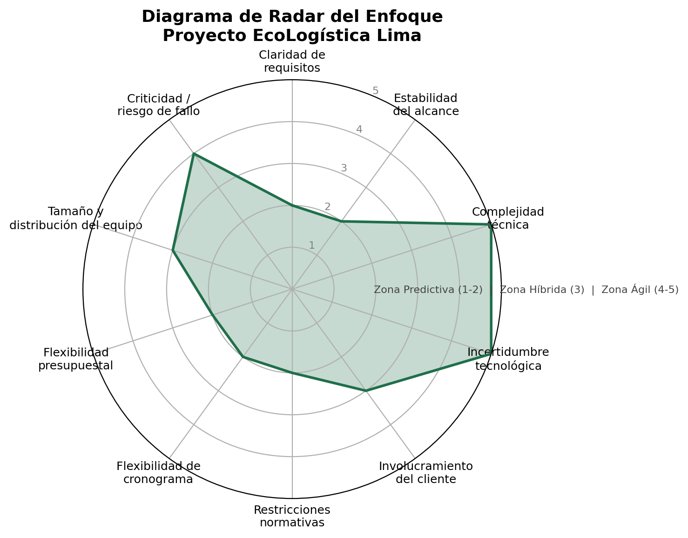

# Selección del Enfoque del Proyecto

## Encabezado de Metadatos

| Campo | Detalle |
| --- | --- |
| **Nombre del Proyecto** | EcoLogística Lima – Optimizador de Rutas Sostenibles para DistriRápido S.A.C. |
| **Integrantes** | JOSUE GONZALES SILUPU (Desarrollo full-stack / Optimización) · CUICAPUZA REMIGIO, NAYELY NILDA · LANDEON ARELLANO, ESAU JOSE |
| **Fecha** | 25 de agosto de 2026 |
| **Versión** | 1.0.0 |

> *Nota: completar los nombres y apellidos de todos los integrantes del equipo antes de la entrega final, conforme al registro oficial del equipo en la hoja "Repositorios".*

---

## 1. Matriz de Ponderación de Variables

Para determinar el enfoque de gestión más adecuado se evaluaron diez variables características del proyecto en una escala de **1 (fuertemente Predictivo) a 5 (fuertemente Ágil)**, siguiendo el criterio de selección de enfoque de desarrollo descrito en el dominio de desempeño *"Enfoque de Desarrollo y Ciclo de Vida"* del PMBOK.

| ID | Variable | Puntaje (1-5) | Justificación breve |
| --- | --- | --- | --- |
| V-01 | Claridad de requisitos | 2 | El documento de consigna define RF, RNF y restricciones desde el inicio (RF-01 a RF-10), lo que reduce la ambigüedad del alcance funcional. |
| V-02 | Estabilidad del alcance | 2 | El alcance del MVP está acotado por la rúbrica y el cronograma académico de 14 semanas; no se esperan cambios mayores de alcance. |
| V-03 | Complejidad técnica | 5 | Resolver un VRPTW con consideraciones ambientales (Green VRP) mediante metaheurísticas (GA, Tabú, ACO) implica algoritmos no triviales y ajuste experimental. |
| V-04 | Incertidumbre tecnológica | 5 | No se sabe a priori qué metaheurística ni qué parametrización ofrecerá el mejor balance costo/tiempo/CO₂; requiere iteración y experimentación. |
| V-05 | Involucramiento del cliente/interesados | 3 | Existe retroalimentación periódica del docente (rol de cliente/sponsor) al final de cada iteración, pero no una disponibilidad diaria tipo Product Owner. |
| V-06 | Restricciones normativas | 2 | Cumplimiento obligatorio y fijo de la Ley N° 29733, la Ley N° 30224 y el D.S. N° 033-2012-MTC, que deben quedar definidos desde el inicio. |
| V-07 | Flexibilidad de cronograma | 2 | El cronograma está fijado por el calendario académico (semanas 1-14) y no admite extensión. |
| V-08 | Flexibilidad presupuestal | 2 | El presupuesto ficticio de S/ 500,000 para el MVP y S/ 120,000 anuales de operación es un techo fijo del caso de negocio. |
| V-09 | Tamaño y distribución del equipo | 3 | Equipo pequeño y co-ubicado (estudiantes de un mismo curso), lo que facilita la coordinación tipo ágil, aunque con dedicación parcial. |
| V-10 | Criticidad / riesgo de fallo | 4 | Un error en el ruteo real tendría impacto económico y de seguridad (zonas de riesgo, ventanas de tiempo), aunque en el contexto académico el MVP se valida de forma controlada. |
| | **Promedio general** | **3.0** | Puntaje central → zona híbrida |

---

## 2. Diagrama de Radar del Enfoque

El polígono resultante muestra un perfil **asimétrico**: las variables asociadas a la *gobernanza* del proyecto (alcance, cronograma, presupuesto, normativa) se concentran en la zona predictiva (puntajes 2), mientras que las variables asociadas a la *construcción técnica* (complejidad e incertidumbre tecnológica) se ubican en la zona ágil (puntajes 5). El promedio general (3.0) confirma que ningún extremo puro (Predictivo o Ágil) describe correctamente al proyecto.

---

## 3. Decisión y Justificación del Enfoque

### 3.1. Enfoque seleccionado: **Híbrido**

Se selecciona un **enfoque híbrido**, con un componente **predictivo** para la capa de gobernanza del proyecto y un componente **ágil/adaptativo** para la capa de construcción del producto.

### 3.2. Argumentación técnica

1. **Gobernanza predictiva justificada por restricciones fijas.** El proyecto opera bajo un alcance, presupuesto (S/ 500,000), cronograma (14 semanas) y marco normativo (Ley N° 29733, Ley N° 30224, D.S. N° 033-2012-MTC) que no son negociables durante la ejecución. Bajo el dominio de desempeño de *Planificación* del PMBOK, este tipo de restricciones "fijas desde el inicio" recomienda fijar líneas base de alcance, costo y cronograma mediante un ciclo de vida predictivo, formalizado en el Acta de Constitución (ver documento 02).

2. **Construcción adaptativa justificada por incertidumbre técnica.** El núcleo del valor del producto —el motor de optimización de rutas (VRPTW + Green VRP)— presenta alta incertidumbre tecnológica (V-04 = 5) y alta complejidad (V-03 = 5). No es posible predecir en la fase de inicio qué metaheurística, qué función objetivo ponderada (distancia, combustible, CO₂, penalidades) ni qué parametrización rendirá mejor. Este tipo de trabajo se beneficia de ciclos cortos de experimentación, medición y ajuste, característicos de un enfoque adaptativo.

3. **Coherencia con el cronograma ya propuesto.** El cronograma sugerido (sección 5 de la consigna del proyecto) ya está organizado en **4 iteraciones** con entregables incrementales (análisis → MVP básico → integración de mapas/dashboard → optimización avanzada). Esta estructura por iteraciones es, en sí misma, una manifestación de ciclo de vida incremental/ágil dentro de una envolvente predictiva de fases (Inicio → Planificación → Iteraciones de construcción → Cierre).

4. **Modelo de tailoring propuesto:**
   - **Capa predictiva (fase de inicio y gobierno):** Acta de Constitución, alcance, presupuesto, cronograma maestro, matriz de riesgos macro y registro de interesados se definen y aprueban una sola vez, con control formal de cambios.
   - **Capa adaptativa (construcción del producto):** Las 4 iteraciones se gestionan como sprints/timeboxes con backlog priorizado de requerimientos funcionales (RF-01 a RF-10), revisión de resultados del algoritmo al cierre de cada iteración y retroalimentación del docente/cliente ficticio para reajustar prioridades del siguiente ciclo.
   - **Punto de integración:** Los hitos de la capa predictiva (fin de cada iteración, presupuesto ejecutado, cumplimiento normativo) actúan como puntos de control (*stage gates*) que verifican que el trabajo adaptativo se mantiene dentro de las restricciones fijadas.

5. **Alineamiento con los principios de gestión de proyectos vigentes.** La decisión es consistente con el principio de *"adaptar el enfoque de desarrollo y el ciclo de vida según el contexto del proyecto"*, y con el dominio de desempeño de *Enfoque de Desarrollo y Ciclo de Vida*, que recomienda explícitamente combinar elementos predictivos y adaptativos (enfoque híbrido) cuando coexisten restricciones contractuales/normativas fijas con componentes de alta incertidumbre técnica — como ocurre en EcoLogística Lima.

### 3.3. Riesgo de no adoptar este enfoque

- Un enfoque **puramente predictivo** obligaría a fijar de antemano la metaheurística y sus parámetros, con alto riesgo de construir un algoritmo subóptimo o inviable en el tiempo de respuesta requerido (RNF-01: ≤45 s).
- Un enfoque **puramente ágil** pondría en riesgo el cumplimiento de restricciones no negociables del caso (presupuesto, cronograma académico y normativa peruana de protección de datos y tránsito), que requieren compromisos formales desde el inicio.
