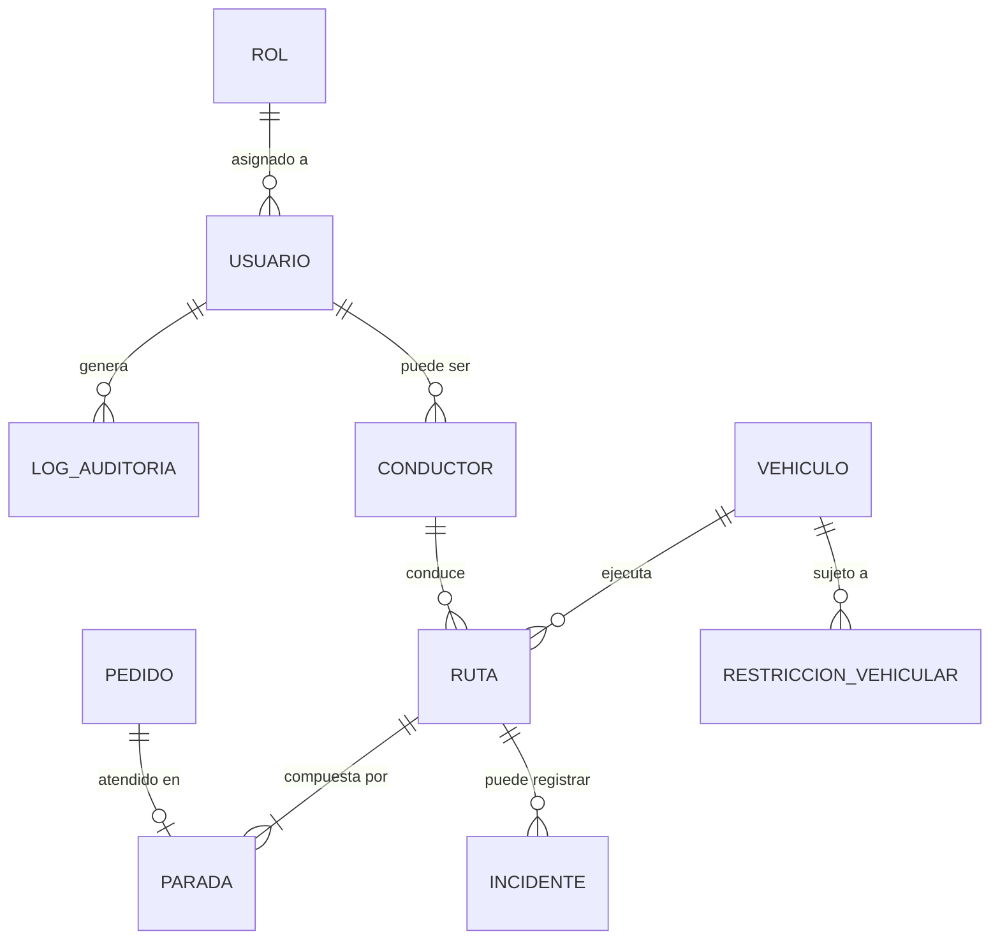

# Diseño e Ingeniería de Base de Datos

| Campo | Detalle |
| --- | --- |
| **Proyecto** | EcoLogística Lima – Optimizador de Rutas Sostenibles |
| **Integrantes** | Josue [Apellidos] · [Nombre integrante 2] · [Nombre integrante 3] |
| **Fecha** | 25 de agosto de 2026 |
| **Versión** | 1.0.0 |

---

## 1. Modelo Conceptual (Diagrama Entidad-Relación)



## 2. Modelo Lógico

| Entidad | Atributos principales | Clave Primaria (PK) | Claves Foráneas (FK) |
| --- | --- | --- | --- |
| **rol** | nombre, descripcion | rol_id | — |
| **usuario** | nombre, email, password_hash, estado, creado_en | usuario_id | rol_id → rol |
| **conductor** | usuario_id, licencia_numero, licencia_vencimiento, jornada_max_horas | conductor_id | usuario_id → usuario |
| **vehiculo** | placa, capacidad_carga_kg, tipo_combustible, factor_emision_co2, estado | vehiculo_id | — |
| **pedido** | direccion, punto_referencia, ventana_inicio, ventana_fin, estado, cliente_nombre, cliente_telefono | pedido_id | — |
| **ruta** | fecha, vehiculo_id, conductor_id, estado, distancia_total_km, costo_estimado, co2_estimado_kg | ruta_id | vehiculo_id → vehiculo, conductor_id → conductor |
| **parada** | ruta_id, pedido_id, orden, hora_estimada_llegada, hora_real_llegada | parada_id | ruta_id → ruta, pedido_id → pedido |
| **incidente** | ruta_id, tipo, descripcion, registrado_por, fecha_registro | incidente_id | ruta_id → ruta, registrado_por → usuario |
| **restriccion_vehicular** | ultimo_digito_placa, dia_semana, hora_inicio, hora_fin | restriccion_id | — |
| **log_auditoria** | usuario_id, accion, modulo, fecha_hora, resultado | log_id | usuario_id → usuario |

**Nivel de normalización:** el modelo se encuentra en **Tercera Forma Normal (3FN)**: todos los atributos no clave dependen exclusivamente de la clave primaria de su entidad (no existen dependencias transitivas), y los datos repetitivos (como el catálogo de restricciones vehiculares por placa) se modelan en una tabla independiente en lugar de duplicarse en `vehiculo`.

## 3. Modelo Físico (DDL SQL) e Índices

```sql
-- Extensión geoespacial (requerida por el stack tecnológico seleccionado)
CREATE EXTENSION IF NOT EXISTS postgis;

CREATE TABLE rol (
    rol_id SMALLSERIAL PRIMARY KEY,
    nombre VARCHAR(50) NOT NULL UNIQUE,
    descripcion VARCHAR(255)
);

CREATE TABLE usuario (
    usuario_id UUID PRIMARY KEY DEFAULT gen_random_uuid(),
    nombre VARCHAR(150) NOT NULL,
    email VARCHAR(255) NOT NULL UNIQUE,
    password_hash VARCHAR(255) NOT NULL,
    rol_id SMALLINT NOT NULL REFERENCES rol(rol_id),
    estado VARCHAR(20) NOT NULL DEFAULT 'ACTIVO',
    creado_en TIMESTAMP WITH TIME ZONE DEFAULT CURRENT_TIMESTAMP
);

CREATE INDEX idx_usuario_email ON usuario(email);

CREATE TABLE conductor (
    conductor_id UUID PRIMARY KEY DEFAULT gen_random_uuid(),
    usuario_id UUID NOT NULL REFERENCES usuario(usuario_id),
    licencia_numero VARCHAR(30) NOT NULL UNIQUE,
    licencia_vencimiento DATE NOT NULL,
    jornada_max_horas SMALLINT NOT NULL DEFAULT 8
);

CREATE TABLE vehiculo (
    vehiculo_id UUID PRIMARY KEY DEFAULT gen_random_uuid(),
    placa VARCHAR(10) NOT NULL UNIQUE,
    capacidad_carga_kg NUMERIC(8,2) NOT NULL,
    tipo_combustible VARCHAR(20) NOT NULL,
    factor_emision_co2 NUMERIC(6,3) NOT NULL,
    estado VARCHAR(20) NOT NULL DEFAULT 'ACTIVO'
);

CREATE TABLE pedido (
    pedido_id UUID PRIMARY KEY DEFAULT gen_random_uuid(),
    direccion VARCHAR(255) NOT NULL,
    punto_referencia VARCHAR(255),
    ubicacion GEOGRAPHY(POINT, 4326),
    ventana_inicio TIMESTAMP WITH TIME ZONE NOT NULL,
    ventana_fin TIMESTAMP WITH TIME ZONE NOT NULL,
    estado VARCHAR(30) NOT NULL DEFAULT 'PENDIENTE',
    cliente_nombre VARCHAR(150),
    cliente_telefono VARCHAR(20),
    CONSTRAINT chk_ventana CHECK (ventana_fin > ventana_inicio)
);

CREATE INDEX idx_pedido_ubicacion ON pedido USING GIST (ubicacion);
CREATE INDEX idx_pedido_estado ON pedido(estado);

CREATE TABLE ruta (
    ruta_id UUID PRIMARY KEY DEFAULT gen_random_uuid(),
    fecha DATE NOT NULL,
    vehiculo_id UUID NOT NULL REFERENCES vehiculo(vehiculo_id),
    conductor_id UUID NOT NULL REFERENCES conductor(conductor_id),
    estado VARCHAR(30) NOT NULL DEFAULT 'PLANIFICADA',
    distancia_total_km NUMERIC(8,2),
    costo_estimado NUMERIC(10,2),
    co2_estimado_kg NUMERIC(8,2)
);

CREATE INDEX idx_ruta_fecha ON ruta(fecha);

CREATE TABLE parada (
    parada_id UUID PRIMARY KEY DEFAULT gen_random_uuid(),
    ruta_id UUID NOT NULL REFERENCES ruta(ruta_id),
    pedido_id UUID NOT NULL REFERENCES pedido(pedido_id),
    orden SMALLINT NOT NULL,
    hora_estimada_llegada TIMESTAMP WITH TIME ZONE,
    hora_real_llegada TIMESTAMP WITH TIME ZONE,
    UNIQUE (ruta_id, orden)
);

CREATE TABLE incidente (
    incidente_id UUID PRIMARY KEY DEFAULT gen_random_uuid(),
    ruta_id UUID NOT NULL REFERENCES ruta(ruta_id),
    tipo VARCHAR(50) NOT NULL,
    descripcion VARCHAR(500),
    registrado_por UUID NOT NULL REFERENCES usuario(usuario_id),
    fecha_registro TIMESTAMP WITH TIME ZONE DEFAULT CURRENT_TIMESTAMP
);

CREATE TABLE restriccion_vehicular (
    restriccion_id SMALLSERIAL PRIMARY KEY,
    ultimo_digito_placa SMALLINT NOT NULL,
    dia_semana SMALLINT NOT NULL,
    hora_inicio TIME NOT NULL,
    hora_fin TIME NOT NULL
);

CREATE TABLE log_auditoria (
    log_id BIGSERIAL PRIMARY KEY,
    usuario_id UUID NOT NULL REFERENCES usuario(usuario_id),
    accion VARCHAR(100) NOT NULL,
    modulo VARCHAR(100) NOT NULL,
    fecha_hora TIMESTAMP WITH TIME ZONE DEFAULT CURRENT_TIMESTAMP,
    resultado VARCHAR(20) NOT NULL
);

CREATE INDEX idx_log_auditoria_usuario ON log_auditoria(usuario_id);
CREATE INDEX idx_log_auditoria_fecha ON log_auditoria(fecha_hora);
```
