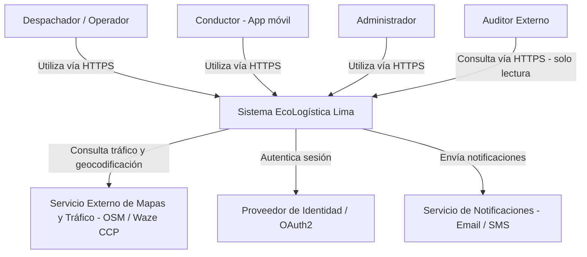
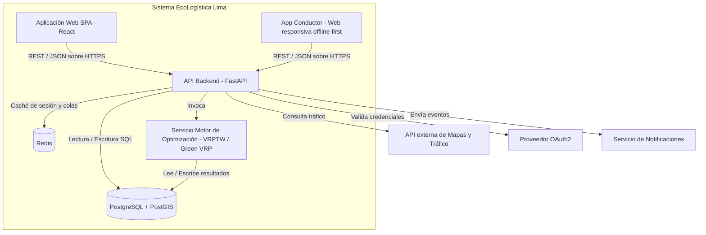
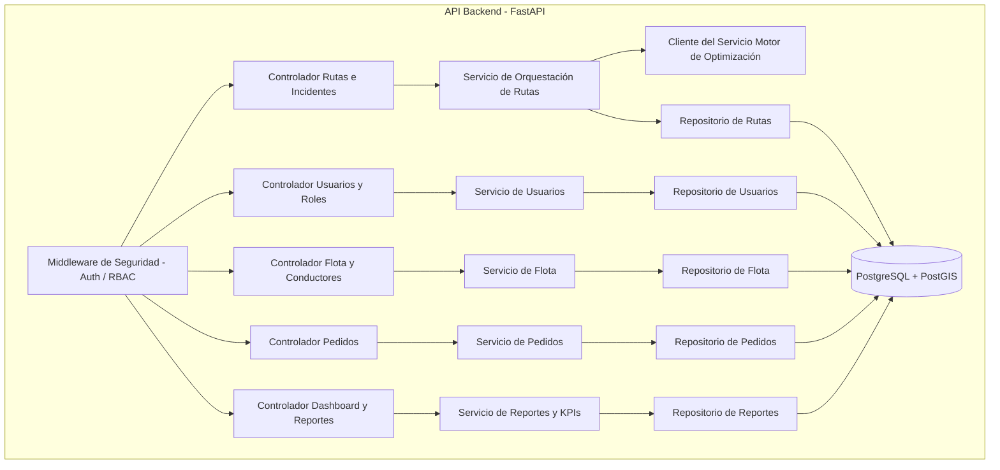

# Arquitectura de Software – Modelo C4

| Campo | Detalle |
| --- | --- |
| **Proyecto** | EcoLogística Lima – Optimizador de Rutas Sostenibles |
| **Integrantes** | Josue [Apellidos] · [Nombre integrante 2] · [Nombre integrante 3] |
| **Fecha** | 25 de agosto de 2026 |
| **Versión** | 1.0.0 |

---

## Nivel 1: Diagrama de Contexto

## Nivel 2: Diagrama de Contenedores

## Nivel 3: Diagrama de Componentes (Contenedor: API Backend)

**Descripción de componentes internos de la API:**

- **Middleware de Seguridad:** valida el token de sesión, resuelve el rol del usuario y aplica las reglas de control de acceso (RBAC) definidas en el documento 08 antes de despachar la petición a cualquier controlador.
- **Controladores:** exponen los endpoints REST agrupados por dominio funcional (usuarios, flota, pedidos, rutas, reportes), y delegan la lógica de negocio a los servicios correspondientes.
- **Servicios:** contienen la lógica de negocio y las reglas descritas en el documento 09 (por ejemplo, `SrvRutas` aplica RN-002, RN-003 y RN-004 antes de invocar al motor de optimización).
- **Cliente del Servicio Motor de Optimización:** capa de integración desacoplada que permite sustituir la metaheurística (Algoritmo Genético, Búsqueda Tabú, ACO) sin modificar los controladores ni los repositorios, conforme al requisito de mantenibilidad RNF-010.
- **Repositorios:** encapsulan el acceso a datos hacia PostgreSQL/PostGIS, aislando el resto de la aplicación de detalles de persistencia.
